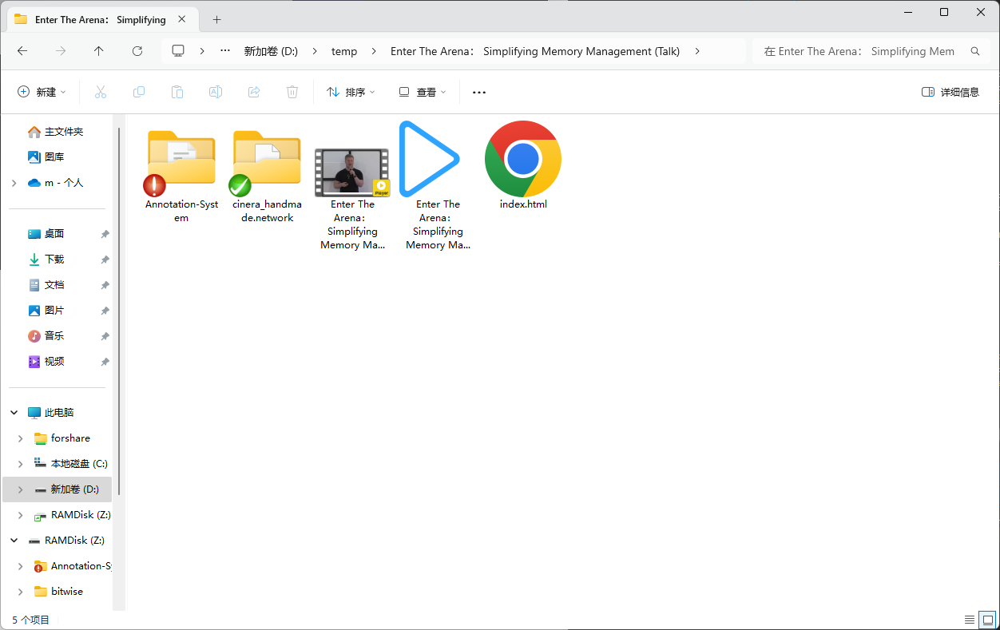
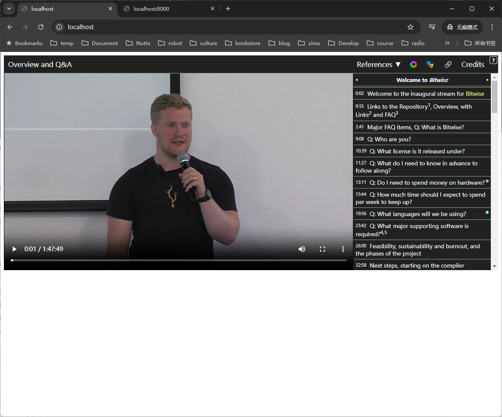
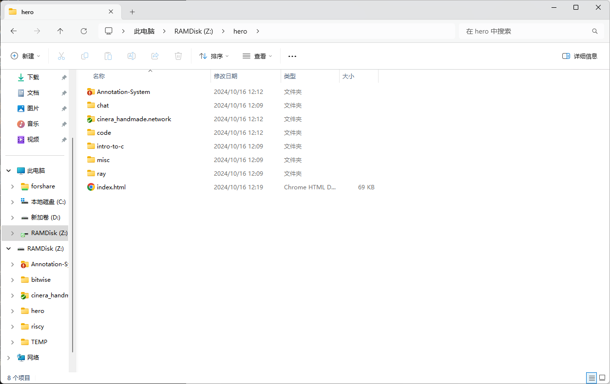
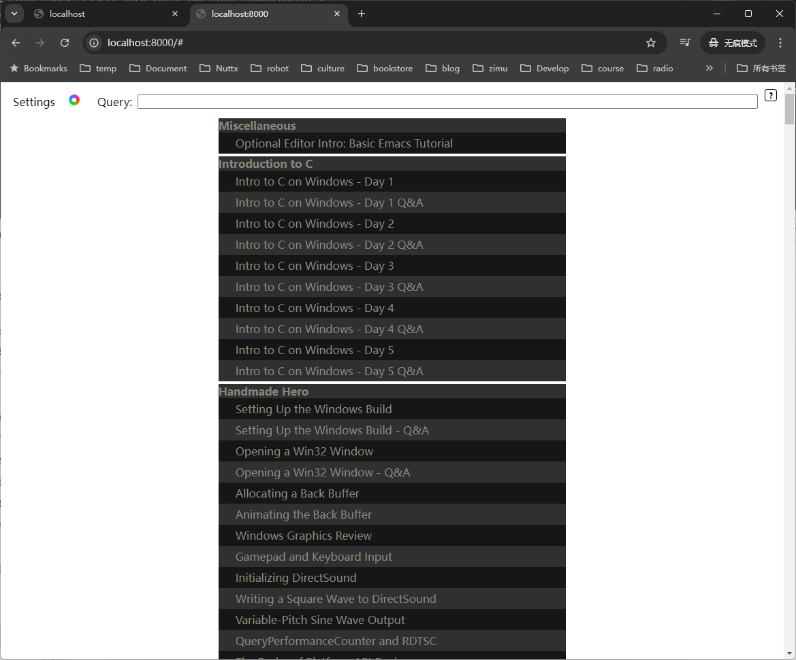
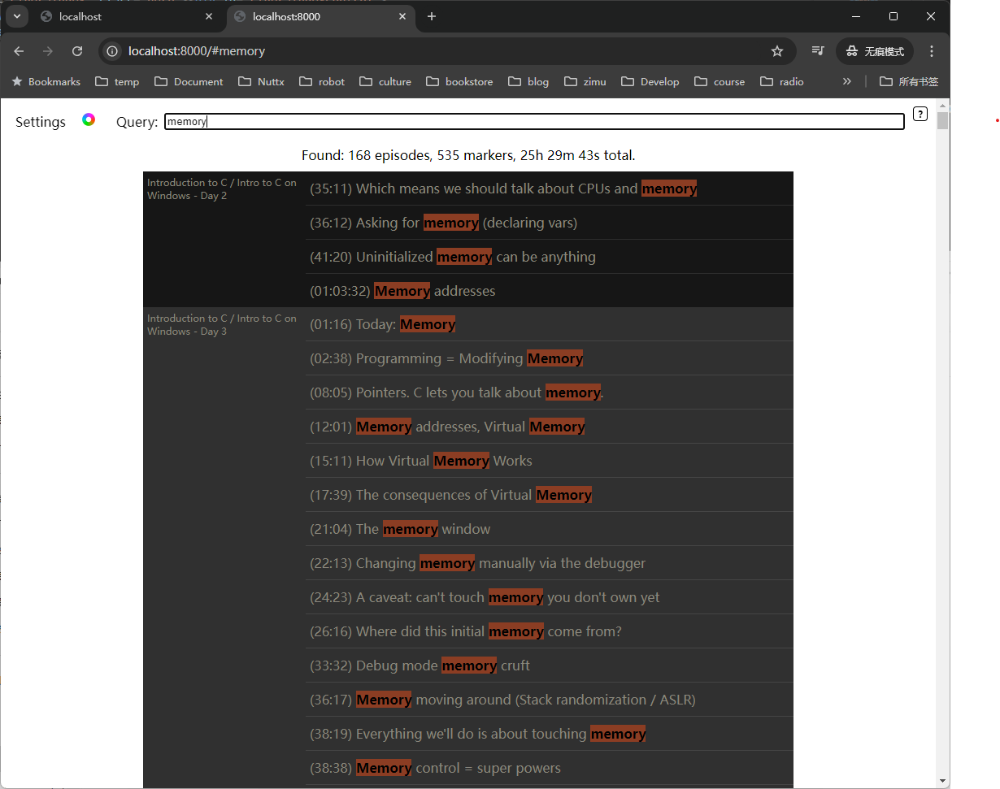

## 1.编译并运行cinera，参考cinera文件夹里的脚本，成功运行之后会在CINERA_OUTPUT_PATH生成处理之后的文件
## 2.有两个示例，一个是工程总览，这个示例可以搜索，跳转到指定视频；另一个是详细播放页，这里改了一个本地播放视频的版本，可以显示标注并且点击标注可以跳转，还可以加载字幕
## 3.如果直接双击html会有跨域问题，可以给chrome加上`--allow-file-access-from-files`参数，html中的link和script标签也得加上`crossorigin="anonymous"`属性。最好还是开一个http服务器，最简单的方法是用python的httpserver，但是有一个问题，它不支持`Accept-Ranges: bytes`，此时需要用另一个httpserver：`pip3 install rangehttpserver`，然后运行：`py.exe -3 -m RangeHTTPServer 8000`

## 截图

### 参考：
* [HTML5 Video Tags: The Ultimate Guide [2024]](https://bitmovin.com/blog/html5-video-tag-guide/)
* [Video player styling basics](https://developer.mozilla.org/en-US/docs/Web/Media/Audio_and_video_delivery/Video_player_styling_basics)
* [10 Advanced Features In The HTML5 <video> Player](https://blog.addpipe.com/10-advanced-features-in-html5-video-player/)
* [\<video\>：视频嵌入元素](https://developer.mozilla.org/zh-CN/docs/Web/HTML/Element/video)